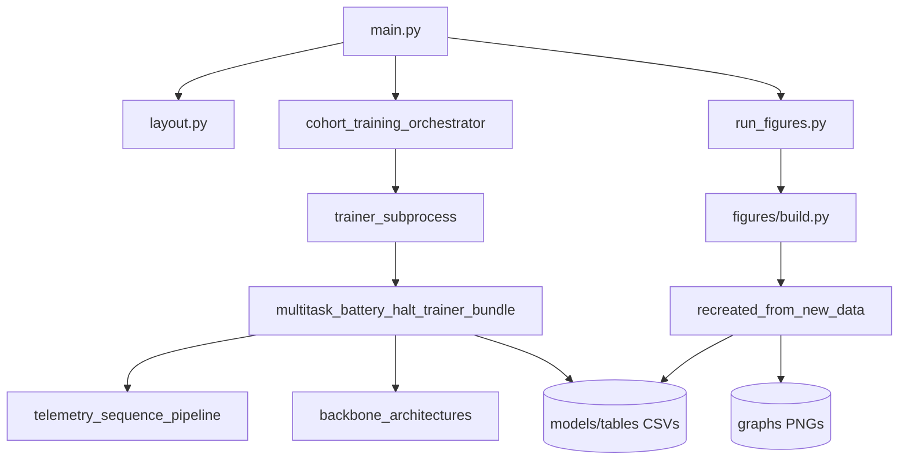

# Python file map — `node_analysis`

Every `.py` file under this folder, what it does, and how it connects.  
Module docstrings use a **FILE STORY** header (role, inputs, connects).

**Developed by Jarkko Ahtiluoma 17.5.2026 with Cursor AI.**

---

## Entry

| File | Role | Connects to |
|------|------|-------------|
| `main.py` | CLI: configure env → train → figures + companions | `layout`, `cohort_training_orchestrator`, `run_figures.py`, `run_companion_tables.py` |

---

## `pipeline/src/node_analysis_pipeline/` — orchestration package

| File | Role | Connects to |
|------|------|-------------|
| `__init__.py` | Package overview (train→figures, env keys) | All submodules |
| `layout.py` | `outputs/<run_id>/models` + `graphs` paths; sets env | `env_config`, `main.py`, trainer, figures |
| `env_config.py` | `NODE_ANALYSIS_*` / `HOL_ACAD_*` registry | Everything reading env |
| `artifact_stems.py` | `node_analysis_<run_id>_<pass>` CSV prefixes | Trainer, `recreated_from_new_data.py` |
| `paths.py` | Trainer script path, `idata/`, `tables/` dirs | `trainer_subprocess`, orchestrator |
| `orchestration/__init__.py` | Subpackage marker | `cohort_training_orchestrator` |
| `orchestration/cohort_training_orchestrator.py` | Runs 4 training passes + report | `trainer_subprocess`, `train_multitask_no_impute` |
| `training/__init__.py` | Subpackage marker | Training wrappers |
| `training/trainer_subprocess.py` | Subprocess → vendored trainer bundle | `multitask_battery_halt_trainer_bundle.py` |
| `training/train_multitask_no_impute.py` | No-impute pass (patch pipeline + in-process train) | `telemetry_sequence_pipeline`, trainer bundle |

---

## `pipeline/figures/` — thesis graphs (11 keys)

| File | Role | Connects to |
|------|------|-------------|
| `build.py` | Build all figures; LSTM-only + utility table extras | `recreated_from_new_data`, `thesis_figure_keys` |
| `recreated_from_new_data.py` | Matplotlib PNG renderers | `models/tables/`, `assets/` |
| `generate_figure_companion_tables.py` | `*_metrics.*` and special companion tables | Same tables as recreated |
| `util.py` | Output dirs + asset path helpers | `build`, recreated, companions |
| `thesis_figure_keys.py` | Allowlist + legacy `fig_*` migration | `figure_titles`, `build` |
| `figure_titles.py` | Frozen titles → PNG basenames | All figure modules |
| `thesis_figure_slugs.py` | Legacy re-exports | `thesis_figure_keys` |

---

## `pipeline/scripts/` — thin runners

| File | Role | Connects to |
|------|------|-------------|
| `run_figures.py` | Runs `figures/build.py` | `main.py` |
| `run_companion_tables.py` | Runs companion generator | `main.py` |
| `discover_cohort.py` | Build ERS CO₂ DevEUI CSV from `idata` | `main.py --discover-cohort` |
| `seed_dummy_smoke.py` | Synthetic `idata/dummy_smoke` | `main.py --dummy-smoke` |
| `run_dummy_smoke.py` | Seed + short smoke train | `seed_dummy_smoke`, `main.py` |
| `rename_graph_outputs.py` | Migrate/rename graph artifacts | `thesis_figure_keys` |
| `run_e2e_clean.py` | Optional legacy e2e driver | Not used for `200trial` archive |

---

## `pipeline/assets/`

| File | Role | Connects to |
|------|------|-------------|
| `pipeline_assets.py` | Paths to bundled reference CSVs | `figures/util`, smoke seed |

---

## `pipeline/runtime_vendor/src/` — training core (vendored)

| File | Role | Connects to |
|------|------|-------------|
| `multitask_battery_halt_trainer_bundle.py` | **Primary trainer** → `models/tables/*.csv` | telemetry, backbones |
| `multitask_battery_halt_trainer.py` | Legacy trainer copy (not used by `main.py`) | Same stack + removed `experiments/` |
| `telemetry_sequence_pipeline.py` | `idata` → daily panel → sequences | Trainer, no-impute patch |
| `backbone_architectures.py` | LSTM / GRU / TCN / Transformer heads | Trainer |

---

## Dependency flow (simplified)

---

## Canonical run outputs (reference)

Active archive: `outputs/node_analysis_200trial/` — `models/tables/`, `models/reports/`, `graphs/` only.  
See `outputs/node_analysis_200trial/ARTIFACT_MAP.md`.
